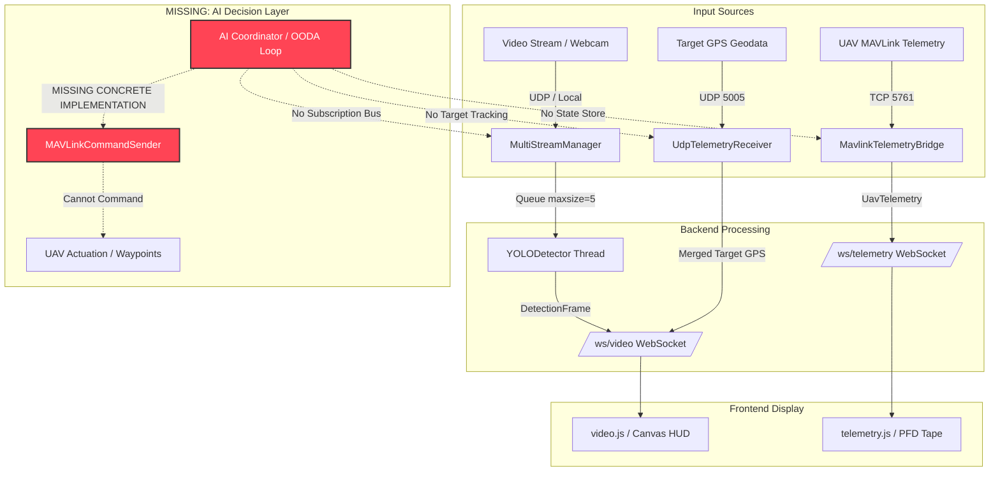
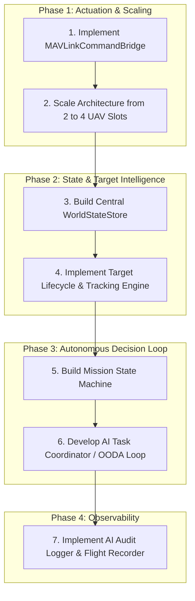

# EXECUTIVE AUDIT REPORT: AI DECISION LAYER READINESS
**To:** Multi-UAV Ground Station Engineering Team  
**From:** Senior Aerospace Software Architect  
**Date:** July 2026  
**Subject:** Complete Codebase Readiness Audit for Autonomous AI Coordination ("AI Decision Layer")

---

## 0. EXECUTIVE SUMMARY & VERDICT

After performing a complete, line-by-line ingestion of the entire ground station codebase—including the FastAPI server, background threading models, WebSocket managers, MAVLink bridges, UDP telemetry receivers, YOLO detection engines, frontend UI scripts, and scratchpad tests—the verdict is **brutally honest**:

> [!WARNING]
> **CURRENT READINESS STATUS: PASSIVE TELEMETRY ROUTER (LEVEL 1 / 5)**  
> The ground station in its current form is a **high-performance passive display and telemetry routing pipeline**. It is engineered to ingest video and MAVLink telemetry, perform per-frame YOLO inference, and push JSON/JPEG payloads to a human operator via WebSocket. 
> 
> **It is currently physically incapable of autonomous closed-loop control.** There is zero backend decision-making logic, no centralized state store, no target persistence, and most critically: **the command transmission layer is an un-implemented abstract interface.**

To transition this system from a passive observer screen into an autonomous **AI Decision Layer** capable of coordinating 2 fixed-wing scouts and 2 quadcopter observers, substantial backend plumbing must be built. Below is the comprehensive assessment against your discovery requirements, data flow tracing, capability checklist, readiness verdict, architecture advice, and prioritized build order.

---

## 1. STEP 1: CODEBASE DISCOVERY & SUMMARY TABLE

Every file in the project has been inspected and mapped. Below is the complete codebase discovery summary table:

| File | Purpose | Key Classes / Functions | Lines |
| :--- | :--- | :--- | :---: |
| [app/main.py](file:///c:/Users/M%20S%20I/Documents/BIMA/ground_station/ground_station/app/main.py) | Application entrypoint, FastAPI initialization, CORS, lifespan dependency injection. | `lifespan(app)`, `app.include_router(...)` | 206 |
| [app/config/settings.py](file:///c:/Users/M%20S%20I/Documents/BIMA/ground_station/ground_station/app/config/settings.py) | Environment configuration and Pydantic settings schema. | `class Settings(BaseSettings)`, `mavlink_host_list` | 107 |
| [app/routers/system.py](file:///c:/Users/M%20S%20I/Documents/BIMA/ground_station/ground_station/app/routers/system.py) | WebSocket `/ws/system` endpoint and REST `/api/system/*` endpoints. | `system_ws()`, `_add_event()`, `get_events()` | 101 |
| [app/routers/telemetry.py](file:///c:/Users/M%20S%20I/Documents/BIMA/ground_station/ground_station/app/routers/telemetry.py) | WebSocket `/ws/telemetry` endpoint and MAVLink connection controls `/api/telemetry/*`. | `telemetry_ws()`, `connect_mavlink()`, `disconnect_mavlink()` | 98 |
| [app/routers/video.py](file:///c:/Users/M%20S%20I/Documents/BIMA/ground_station/ground_station/app/routers/video.py) | WebSocket `/ws/video/{port}` endpoint and `/api/video/detect` REST endpoint. | `video_ws()`, `detect_frame()`, `toggle_yolo()` | 176 |
| [app/services/mavlink/connection.py](file:///c:/Users/M%20S%20I/Documents/BIMA/ground_station/ground_station/app/services/mavlink/connection.py) | TCP MAVLink connection wrapper using `pymavlink`. | `class MavlinkTCPConnection(MAVLinkConnection)`, `connect()`, `recv_msg()` | 106 |
| [app/services/mavlink/interfaces.py](file:///c:/Users/M%20S%20I/Documents/BIMA/ground_station/ground_station/app/services/mavlink/interfaces.py) | Abstract base classes and data contracts for MAVLink integration. | `MAVLinkConnection`, `MAVLinkTelemetryBridge`, `MAVLinkCommandSender`, `MAVLinkMissionManager` | 169 |
| [app/services/mavlink/telemetry_bridge.py](file:///c:/Users/M%20S%20I/Documents/BIMA/ground_station/ground_station/app/services/mavlink/telemetry_bridge.py) | Dual-slot MAVLink TCP bridge reading heartbeats and GPS/attitude packets. | `class MavlinkTelemetryBridge`, `broadcast_loop()`, `connect_slot()` | 165 |
| [app/services/telemetry/generator.py](file:///c:/Users/M%20S%20I/Documents/BIMA/ground_station/ground_station/app/services/telemetry/generator.py) | Simulated UAV telemetry generator for fallback testing. | `class TelemetryGenerator`, `class TelemetryPacket`, `broadcast_loop()` | 259 |
| [app/services/telemetry/udp_telemetry.py](file:///c:/Users/M%20S%20I/Documents/BIMA/ground_station/ground_station/app/services/telemetry/udp_telemetry.py) | Receives JSON target geodata over UDP Port 5005 from UAV edge AI. | `class UdpTelemetryReceiver`, `_receive_loop()` | 79 |
| [app/services/video/manager.py](file:///c:/Users/M%20S%20I/Documents/BIMA/ground_station/ground_station/app/services/video/manager.py) | Multi-stream orchestration, video broadcast loop, and YOLO queueing. | `class MultiStreamManager`, `_broadcast_loop()`, `_maybe_broadcast_detections()` | 261 |
| [app/services/video/receiver.py](file:///c:/Users/M%20S%20I/Documents/BIMA/ground_station/ground_station/app/services/video/receiver.py) | Receives raw JPEG packets over UDP Port 5000/5006 or webcam frames. | `class VideoReceiver`, `_receive_loop_udp()`, `_receive_loop_camera()` | 250 |
| [app/services/websocket/manager.py](file:///c:/Users/M%20S%20I/Documents/BIMA/ground_station/ground_station/app/services/websocket/manager.py) | Central asyncio hub for broadcasting data to WebSocket clients. | `class WebSocketManager`, `broadcast_video()`, `broadcast_telemetry()` | 161 |
| [app/services/yolo/detector.py](file:///c:/Users/M%20S%20I/Documents/BIMA/ground_station/ground_station/app/services/yolo/detector.py) | Background daemon thread running Ultralytics YOLO inference. | `class YOLODetector`, `enqueue()`, `_run_loop()`, `_infer()` | 463 |
| [app/static/css/styles.css](file:///c:/Users/M%20S%20I/Documents/BIMA/ground_station/ground_station/app/static/css/styles.css) | Vanilla CSS tokens, grid layout, glassmorphism UI rules. | N/A (CSS styling) | 1054 |
| [app/static/js/camera.js](file:///c:/Users/M%20S%20I/Documents/BIMA/ground_station/ground_station/app/static/js/camera.js) | Client-side webcam enumeration and frame submission to `/api/video/detect`. | `initCamera()`, `sendFrameForDetection()` | 528 |
| [app/static/js/system.js](file:///c:/Users/M%20S%20I/Documents/BIMA/ground_station/ground_station/app/static/js/system.js) | Client-side `/ws/system` log handling and YOLO toggle switch handler. | `connectSystemWs()`, `toggleYolo()` | 175 |
| [app/static/js/telemetry.js](file:///c:/Users/M%20S%20I/Documents/BIMA/ground_station/ground_station/app/static/js/telemetry.js) | Client-side `/ws/telemetry` handler, PFD rendering, altitude tape, MAVLink slots. | `handleTelemetryMsg()`, `updatePFD()`, `setupMavlinkControls()` | 293 |
| [app/static/js/video.js](file:///c:/Users/M%20S%20I/Documents/BIMA/ground_station/ground_station/app/static/js/video.js) | Client-side `/ws/video/{port}` handler, JPEG canvas render, bounding box HUD. | `connectVideoWs()`, `window.GS_setDetections()`, `drawOverlay()` | 697 |
| [app/templates/index.html](file:///c:/Users/M%20S%20I/Documents/BIMA/ground_station/ground_station/app/templates/index.html) | Main 4-column UI layout (CH01 Video, UAV-1 Telem, UAV-2 Telem, CH02 Video). | N/A (HTML structure) | 479 |
| [dump_trash/simgeo.py](file:///c:/Users/M%20S%20I/Documents/BIMA/ground_station/ground_station/dump_trash/simgeo.py) | Scratchpad WGS84 geolocation math for projecting camera pixels to GPS. | `pixel_to_gps()`, `calculate_target_gps()` | 422 |
| [dump_trash/testmav.py](file:///c:/Users/M%20S%20I/Documents/BIMA/ground_station/ground_station/dump_trash/testmav.py) | Scratchpad script demonstrating pymavlink mission/waypoint upload. | `upload_mission()`, `master.mav.mission_item_int_send()` | 136 |
| [testcuda.py](file:///c:/Users/M%20S%20I/Documents/BIMA/ground_station/ground_station/testcuda.py) | Small verification script for PyTorch CUDA availability. | `torch.cuda.is_available()` | 5 |
| [testingcuda.py](file:///c:/Users/M%20S%20I/Documents/BIMA/ground_station/ground_station/testingcuda.py) | Small verification script for Ultralytics YOLO inference. | `model.predict(...)` | 5 |
| [README.md](file:///c:/Users/M%20S%20I/Documents/BIMA/ground_station/ground_station/README.md) | Project architecture documentation and startup guide. | N/A (Markdown) | ~408 |
| [gcs_programmer_brief.md](file:///c:/Users/M%20S%20I/Documents/BIMA/ground_station/ground_station/gcs_programmer_brief.md) | Technical integration brief for GCS programmer (UDP video & telemetry protocol). | N/A (Markdown) | 93 |
| [uav_programmer_brief_udpategps.md](file:///c:/Users/M%20S%20I/Documents/BIMA/ground_station/ground_station/uav_programmer_brief_udpategps.md) | Brief on UAV headless edge-computing optimizations. | N/A (Markdown) | 34 |
| [AI_DECISION_LAYER_AUDIT.md](file:///c:/Users/M%20S%20I/Documents/BIMA/ground_station/ground_station/AI_DECISION_LAYER_AUDIT.md) | The audit report generated for architectural review. | N/A (Markdown) | 249 |

---

## 2. STEP 2: DATA FLOW TRACING & ARCHITECTURAL MAP

The current system architecture is designed almost exclusively for visual human observation. The diagram below illustrates the current data paths versus where the autonomous control loop is missing:



### PATH A — Video Detection (UDP Stream → YOLO → UI Display)
* **Trace:**
  1. **UDP Video Stream (Port 5000/5006):** Received by `VideoReceiver._receive_loop_udp()` in [app/services/video/receiver.py:L214-L250](file:///c:/Users/M%20S%20I/Documents/BIMA/ground_station/ground_station/app/services/video/receiver.py#L214-L250). It decodes raw JPEG bytes into an OpenCV numpy array stored atomically in `self._latest_frame`.
  2. **UDP Target Geodata (Port 5005):** Received independently by `UdpTelemetryReceiver._receive_loop()` in [app/services/telemetry/udp_telemetry.py:L50-L73](file:///c:/Users/M%20S%20I/Documents/BIMA/ground_station/ground_station/app/services/telemetry/udp_telemetry.py#L50-L73). It decodes JSON strings into python dictionaries stored in `self._latest_data`.
  3. **YOLO Inference:** In [app/services/video/manager.py:L181-L183](file:///c:/Users/M%20S%20I/Documents/BIMA/ground_station/ground_station/app/services/video/manager.py#L181-L183), `MultiStreamManager._broadcast_loop()` passes the frame to `YOLODetector.enqueue(port, frame)`. The background thread `YOLODetector._run_loop()` ([detector.py:L321-L361](file:///c:/Users/M%20S%20I/Documents/BIMA/ground_station/ground_station/app/services/yolo/detector.py#L321-L361)) runs `_infer()`, creates a `DetectionFrame`, and saves it to `self._latest[port]`.
  4. **WebSocket Broadcast:** In [detector.py:L431-L434](file:///c:/Users/M%20S%20I/Documents/BIMA/ground_station/ground_station/app/services/yolo/detector.py#L431-L434), `ws_manager.broadcast_video_detections()` pushes detection JSON to `/ws/video/{port}`. Simultaneously, in [manager.py:L207-L230](file:///c:/Users/M%20S%20I/Documents/BIMA/ground_station/ground_station/app/services/video/manager.py#L207-L230), `_maybe_broadcast_detections()` pushes UDP target telemetry JSON (tagged with `'type': 'telemetry'`) to the same WebSocket channel.
  5. **Frontend Display:** In [app/static/js/video.js:L531-L545](file:///c:/Users/M%20S%20I/Documents/BIMA/ground_station/ground_station/app/static/js/video.js#L531-L545), `window.GS_setDetections()` receives the text payload, stores it in `stream.latestDetections`, draws bounding boxes on the canvas, and renders target coordinates (`data.lokasi_target.lat`, `lon`) to the HUD overlay text.
* **Verdict:** **DATA FLOW COMPLETE** (for display only).

### PATH B — Telemetry (MAVLink Connection → State Storage → UI Display)
* **Trace:**
  1. **MAVLink Connection (TCP 5761):** Established by `MavlinkTCPConnection.connect()` in [app/services/mavlink/connection.py:L26-L65](file:///c:/Users/M%20S%20I/Documents/BIMA/ground_station/ground_station/app/services/mavlink/connection.py#L26-L65).
  2. **Message Parsing:** `MavlinkTelemetryBridge.broadcast_loop()` in [app/services/mavlink/telemetry_bridge.py:L84-L153](file:///c:/Users/M%20S%20I/Documents/BIMA/ground_station/ground_station/app/services/mavlink/telemetry_bridge.py#L84-L153) polls `conn.recv_msg()`. It parses `HEARTBEAT`, `GLOBAL_POSITION_INT`, `ATTITUDE`, `VFR_HUD`, `SYS_STATUS`, and `GPS_RAW_INT`.
  3. **State Storage:** The parsed attributes are updated inside `self.latest_packets[slot]` (instances of `TelemetryPacket` defined in [generator.py:L26-L85](file:///c:/Users/M%20S%20I/Documents/BIMA/ground_station/ground_station/app/services/telemetry/generator.py#L26-L85)).
  4. **WebSocket Broadcast:** In [telemetry_bridge.py:L148](file:///c:/Users/M%20S%20I/Documents/BIMA/ground_station/ground_station/app/services/mavlink/telemetry_bridge.py#L148), `self._ws.broadcast_telemetry(payload)` sends JSON strings over `/ws/telemetry`.
  5. **Frontend Display:** In [app/static/js/telemetry.js:L81-L156](file:///c:/Users/M%20S%20I/Documents/BIMA/ground_station/ground_station/app/static/js/telemetry.js#L81-L156), `handleTelemetryMsg()` unpacks the JSON and calls `updatePFD(data)` (pitch/roll/yaw tape), `updateAltitudeTape(data)`, and populates DOM elements for GPS Fix, Lat/Lon, Speed, and Battery voltage.
* **Verdict:** **DATA FLOW COMPLETE** (for passive monitoring).

### PATH C — User Commands (UI Event → Backend Handler → MAVLink Transmission)
* **Trace:**
  1. **UI Event:** In [app/static/js/telemetry.js:L236-L270](file:///c:/Users/M%20S%20I/Documents/BIMA/ground_station/ground_station/app/static/js/telemetry.js#L236-L270), clicking the "Connect" or "Disconnect" buttons on the MAVLink panel triggers an HTTP POST fetch to `/api/telemetry/connect` or `/api/telemetry/disconnect`.
  2. **API Handler:** In [app/routers/telemetry.py:L75-L90](file:///c:/Users/M%20S%20I/Documents/BIMA/ground_station/ground_station/app/routers/telemetry.py#L75-L90), `connect_mavlink()` invokes `telemetry_generator_instance.connect_slot(req.slot, req.ip, req.port)`.
  3. **Does it send MAVLink back?** **NO.** The endpoints only open or close TCP socket streams for incoming telemetry. There are zero REST endpoints, WebSocket handlers, or UI buttons for sending flight commands (waypoints, mode switching, arm/disarm) to the UAVs.
* **Verdict:** **BREAKS HERE: No command transmission plumbing or actuator API exists in the backend.**

---

## 3. STEP 3: CAPABILITY CHECKLIST & CODE EVIDENCE

Evaluate each item quoting actual code (`file:line`) as evidence:

- `[ ]` **TARGET STATE EXISTS: NO (Unchecked)**  
  *Evidence:* Detections are stored ephemerally in [app/services/yolo/detector.py:L425-L427](file:///c:/Users/M%20S%20I/Documents/BIMA/ground_station/ground_station/app/services/yolo/detector.py#L425-L427):
  ```python
  with self._lock:
      self._latest[port] = frame_result
  ```
  and UDP target GPS in [app/services/telemetry/udp_telemetry.py:L61-L63](file:///c:/Users/M%20S%20I/Documents/BIMA/ground_station/ground_station/app/services/telemetry/udp_telemetry.py#L61-L63):
  ```python
  with self._lock:
      self._latest_data = parsed
      self._latest_data["_received_at"] = time.time()
  ```
  There is no data structure storing currently detected targets with `assigned_status` or persistent tracking across time.

- `[ ]` **MULTI-UAV STATE EXISTS: NO (Unchecked)**  
  *Evidence:* In [app/services/mavlink/telemetry_bridge.py:L27-L35](file:///c:/Users/M%20S%20I/Documents/BIMA/ground_station/ground_station/app/services/mavlink/telemetry_bridge.py#L27-L35), state storage is strictly hardcoded to 2 slots:
  ```python
  self.connections: Dict[int, Optional[MavlinkTCPConnection]] = {1: None, 2: None}
  self.latest_packets: Dict[int, TelemetryPacket] = {
      1: TelemetryPacket(vehicle_id=1, vehicle_name="UAV-01"),
      2: TelemetryPacket(vehicle_id=2, vehicle_name="UAV-02")
  }
  ```
  There is no single place where all 4 UAVs' states are stored, and `current_task` does not exist in `TelemetryPacket` ([generator.py:L26-L85](file:///c:/Users/M%20S%20I/Documents/BIMA/ground_station/ground_station/app/services/telemetry/generator.py#L26-L85)).

- `[ ]` **MAVLINK WRITE CAPABILITY: NO (Unchecked)**  
  *Evidence:* In [app/services/mavlink/interfaces.py:L141-L169](file:///c:/Users/M%20S%20I/Documents/BIMA/ground_station/ground_station/app/services/mavlink/interfaces.py#L141-L169), `MAVLinkCommandSender` only defines abstract methods (`@abc.abstractmethod`). While `MavlinkTCPConnection.send_message()` is implemented in [app/services/mavlink/connection.py:L78-L81](file:///c:/Users/M%20S%20I/Documents/BIMA/ground_station/ground_station/app/services/mavlink/connection.py#L78-L81):
  ```python
  async def send_message(self, message: Any) -> None:
      if self._master:
          self._master.mav.send(message)
  ```
  zero backend services invoke it to command UAVs. Working mission upload code only exists in scratchpad file [dump_trash/testmav.py:L40-L80](file:///c:/Users/M%20S%20I/Documents/BIMA/ground_station/ground_station/dump_trash/testmav.py#L40-L80).

- `[ ]` **EVENT/ACTION SYSTEM: NO (Unchecked)**  
  *Evidence:* The only inter-component communication mechanisms are FIFO drop-queues for video frames (`self._queue = queue.Queue(maxsize=5)` in [detector.py:L178](file:///c:/Users/M%20S%20I/Documents/BIMA/ground_station/ground_station/app/services/yolo/detector.py#L178)) and WebSocket broadcasters ([manager.py:L27-L29](file:///c:/Users/M%20S%20I/Documents/BIMA/ground_station/ground_station/app/services/websocket/manager.py#L27-L29)). There is no event bus, pub/sub, or callback mechanism where a detection on UAV-1 triggers an action on UAV-3.

- `[ ]` **TARGET LIFECYCLE TRACKING: NO (Unchecked)**  
  *Evidence:* In [app/services/yolo/detector.py:L416-L427](file:///c:/Users/M%20S%20I/Documents/BIMA/ground_station/ground_station/app/services/yolo/detector.py#L416-L427), `DetectionFrame` creates a fresh list of `Detection` objects on every single video frame. They are fire-and-forget; no target UUID, validation, assignment, or completion state exists.

- `[ ]` **MISSION PHASE MANAGEMENT: NO (Unchecked)**  
  *Evidence:* In [app/services/mavlink/telemetry_bridge.py:L107](file:///c:/Users/M%20S%20I/Documents/BIMA/ground_station/ground_station/app/services/mavlink/telemetry_bridge.py#L107), `flight_mode` is passively mapped from incoming autopilot heartbeats:
  ```python
  pkt.flight_mode = self._mode_mapping.get(custom_mode, f"MODE_{custom_mode}")
  ```
  There is no GCS-level mission phase state machine (SEARCH/OBSERVE/RTB).

- `[x]` **BACKGROUND PROCESSING CAPABILITY: YES (Checked)**  
  *Evidence:* In [app/main.py:L82-L83](file:///c:/Users/M%20S%20I/Documents/BIMA/ground_station/ground_station/app/main.py#L82-L83), the backend actively spawns background asyncio loops:
  ```python
  asyncio.create_task(telemetry_generator.broadcast_loop())
  ```
  Additionally, daemon threads are actively used for blocking I/O, such as `threading.Thread(target=self._run_loop, name="YOLODetector", daemon=True)` in [detector.py:L290-L292](file:///c:/Users/M%20S%20I/Documents/BIMA/ground_station/ground_station/app/services/yolo/detector.py#L290-L292) and in [udp_telemetry.py:L35](file:///c:/Users/M%20S%20I/Documents/BIMA/ground_station/ground_station/app/services/telemetry/udp_telemetry.py#L35). This proves the server architecture is ready to host a continuous AI decision loop.

- `[ ]` **LOGGING / EVENT HISTORY: NO (Unchecked)**  
  *Evidence:* In [app/routers/system.py:L24-L40](file:///c:/Users/M%20S%20I/Documents/BIMA/ground_station/ground_station/app/routers/system.py#L24-L40), system logs are stored in a volatile in-memory buffer:
  ```python
  _EVENT_BUFFER: list[dict] = []
  _MAX_EVENTS = 200
  ```
  Once 200 events pass or the server restarts, history is wiped. There is zero database or file persistence for querying target detection histories.

---

## 4. STEP 4: READINESS VERDICT & FOUNDATIONAL ROADMAP

Count: **1 / 8 boxes checked.**  
**VERDICT: NOT READY.** The project needs foundational work before an autonomous AI Decision Layer can be injected.

### Phased Foundational Roadmap

#### Phase 1: Data Infrastructure (What to build)
1. **Central World State Store (`app/services/state/world_model.py`):**
   * Build a thread-safe registry (`WorldModel`) that aggregates real-time kinematic data for **4 UAV slots** (expanding from the hardcoded 2 slots).
   * Define `UAVState` dataclass: `slot, role (SCOUT/OBSERVER), lat, lon, alt, speed, heading, battery, mode, assigned_target_uuid`.
2. **Persistent Target Registry (`app/services/intelligence/target_manager.py`):**
   * Build a target lifecycle tracker (`TargetManager`).
   * When YOLO or UDP Port 5005 reports a target coordinate, perform a spatial de-duplication check (Haversine distance $< 15\text{m}$).
   * Assign unique IDs (`TGT-001`) and implement lifecycle transitions: `DISCOVERED` $\rightarrow$ `VERIFIED` $\rightarrow$ `ASSIGNED` $\rightarrow$ `RESOLVED` / `LOST`.

#### Phase 2: Command Infrastructure (What to build)
1. **Concrete MAVLink Actuator (`app/services/mavlink/command_sender.py`):**
   * Subclass `MAVLinkCommandSender` and `MAVLinkMissionManager` from [interfaces.py](file:///c:/Users/M%20S%20I/Documents/BIMA/ground_station/ground_station/app/services/mavlink/interfaces.py).
   * Port the working `pymavlink` waypoint upload logic from [dump_trash/testmav.py:L40-L80](file:///c:/Users/M%20S%20I/Documents/BIMA/ground_station/ground_station/dump_trash/testmav.py#L40-L80) into class methods:
     * `set_mode(slot, "GUIDED")`
     * `send_reposition_target_global(slot, lat, lon, alt)`
     * `upload_mission(slot, waypoints)`
2. **Actuator API Wiring:**
   * Inject the command sender into `MavlinkTelemetryBridge` and expose REST endpoints `/api/command/reposition` and `/api/command/mode` for testing.

#### Phase 3: AI Decision Layer Integration
Once Phase 1 & 2 are complete:
1. **Mission State Machine (`app/services/decision/mission_state.py`):**
   * Implement system phase transitions: `SEARCHING` $\rightarrow$ `TARGET_ACQUIRED` $\rightarrow$ `TASKING_OBSERVER` $\rightarrow$ `OVERWATCH`.
2. **AI Task Coordinator (`app/services/decision/coordinator.py`):**
   * Launch a 5 Hz background asyncio task in [app/main.py](file:///c:/Users/M%20S%20I/Documents/BIMA/ground_station/ground_station/app/main.py) that executes the OODA loop:
     * **Observe:** Query `WorldModel` and `TargetManager`.
     * **Orient:** Filter for `VERIFIED` unassigned targets and available Observer quadcopters (`role == OBSERVER`, `mode in [LOITER, GUIDED]`).
     * **Decide:** Calculate Euclidean distance + time-to-intercept to pair the closest Observer to the Target.
     * **Act:** Transition Target to `ASSIGNED`, set Observer mode to `GUIDED`, and invoke `command_sender.send_reposition_target_global(...)`.

---

## 5. STEP 5: ARCHITECTURE ADVICE

1. **Where should the AI Decision Layer run?**
   * **Answer:** **Backend server** (embedded directly inside the FastAPI Python process as a background async service module).
   * **Because:** The FastAPI backend already uses an in-memory dependency injection pattern in [app/main.py:L62-L88](file:///c:/Users/M%20S%20I/Documents/BIMA/ground_station/ground_station/app/main.py#L62-L88), where singleton service instances (`video_manager`, `telemetry_generator`, `ws_manager`, `yolo_detector`) are instantiated during startup and shared across routes. An AI coordinator module running inside the same process can directly read atomic snapshots from `MavlinkTelemetryBridge` and `YOLODetector` without network IPC overhead, serialization latency, or managing another microservice container.

2. **What's the simplest viable first version of the AI layer?**
   * **Answer:** **Rule-based scoring** (Distance-based cost function / heuristic matching).
   * **Because:** The input data available in [udp_telemetry.py:L45-L53](file:///c:/Users/M%20S%20I/Documents/BIMA/ground_station/ground_station/app/services/telemetry/udp_telemetry.py#L45-L53) (`lokasi_target` with lat, lon, distance_m) and [telemetry_bridge.py:L111-L118](file:///c:/Users/M%20S%20I/Documents/BIMA/ground_station/ground_station/app/services/mavlink/telemetry_bridge.py#L111-L118) (UAV lat, lon, alt, ground_speed_ms, battery_remaining_pct) is purely tabular kinematic data. A simple cost function measuring Euclidean GPS distance and verifying battery $> 20\%$ can instantaneously calculate time-to-intercept and dispatch the optimal observer quadcopter without the complexity or training requirements of a neural network.

3. **What's the #1 BLOCKER preventing AI integration right now?**
   * **Answer:** **The complete absence of a concrete command transmission implementation (`MAVLinkCommandSender`).** Without backend methods to send `MAV_CMD_DO_REPOSITION` or switch UAV flight modes to `GUIDED`, the server is physically read-only and incapable of closing the actuation loop.

---

## 6. PRIORITIZED BUILD ORDER & IMPLEMENTATION BLUEPRINT

To build the "AI Decision Layer" cleanly on top of the existing FastAPI/threading foundation **without rewriting or breaking existing working code**, execute this architectural build order:



### Summary Table of Implementation Tasks

| Phase | Step | Module / Component | Target File Path | Risk / Blocking Level | Description |
| :---: | :---: | :--- | :--- | :---: | :--- |
| **1** | **1** | MAVLink Command Bridge | `app/services/mavlink/command_sender.py` | **BLOCKING (CRITICAL)** | Implement `MAVLinkCommandSender` & `MAVLinkMissionManager` using code ported from `dump_trash/testmav.py`. Enables guided waypoints & mode changes. |
| **1** | **2** | 4-UAV Slot Scaling | `app/services/mavlink/telemetry_bridge.py`<br>`app/services/video/manager.py` | **HIGH** | Refactor dictionaries and slot indices from hardcoded `1 & 2` to dynamic `1..4` (Slots 1-2: Scouts, Slots 3-4: Observers). |
| **2** | **3** | Central World State Store | `app/services/state/world_model.py` | **HIGH** | Build an atomic, thread-safe memory registry aggregating real-time UAV GPS/attitude and YOLO target detections. |
| **2** | **4** | Target Tracking Engine | `app/services/intelligence/target_manager.py` | **MEDIUM** | Add spatial clustering (haversine de-duplication $<15\text{m}$), persistent UUIDs (`TGT-001`), and state transitions (`DISCOVERED` $\rightarrow$ `ASSIGNED`). |
| **3** | **5** | Mission State Machine | `app/services/state/mission_state.py` | **MEDIUM** | Define formal operational transitions (`SEARCHING`, `TARGET_ACQUIRED`, `TASKING_OBSERVER`, `OVERWATCH`, `RTB`). |
| **3** | **6** | AI Task Coordinator | `app/services/decision/coordinator.py` | **CORE AI LAYER** | Implement a 5 Hz OODA loop that evaluates unassigned targets and pairs them to available Observer quadcopters via cost-function optimization. |
| **4** | **7** | AI Audit Logger | `app/services/logging/audit_logger.py` | **LOW (REQUIRED FOR OPS)** | Record structured JSONL decision histories (`why` tasked, confidence score, coordinates, MAVLink ACKs) to `<workspace>/logs/flight_mission.jsonl`. |

---
*End of Complete Audit Report.*
